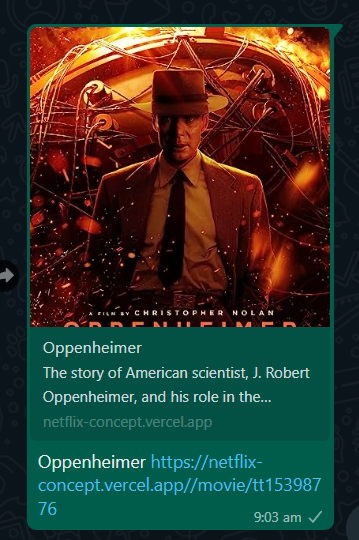
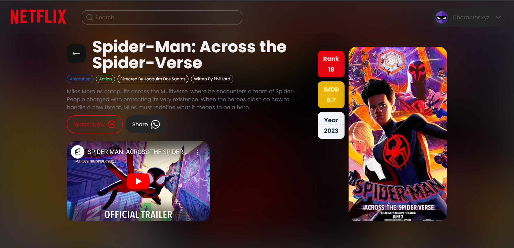
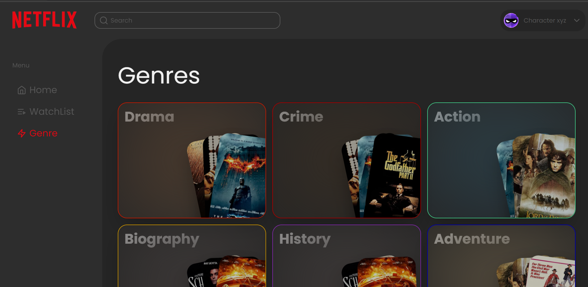
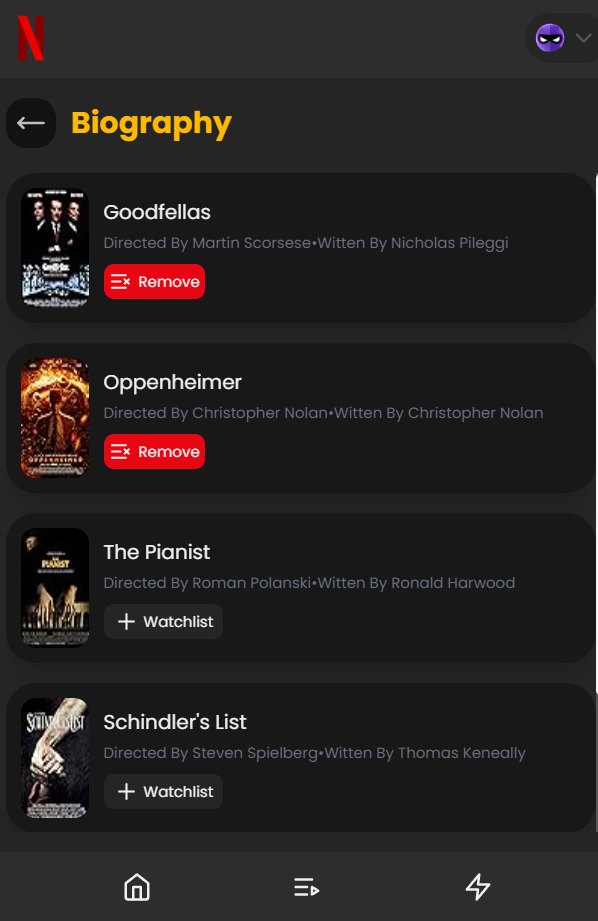
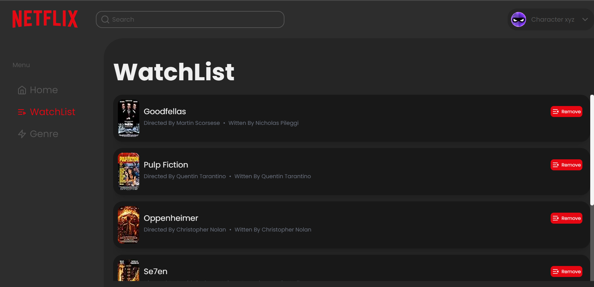

# Character XYZ assignment

this project is created as an assignment of characterxyz

__Detailed Document__ - https://github.com/JayashTripathy/netflix-concept/blob/master/document.md

__Deployed Site__ - https://netflix-concept.vercel.app

## Functionalities 

- Server side rendered optimized pages
- Search engine-optimized pages  
   

- Minimal and user-friendly UI 
   
    

- Fully responsive from mobile to big screens
    
  
- Watchlist Functionality, can add or remove movies to watchlist
    

